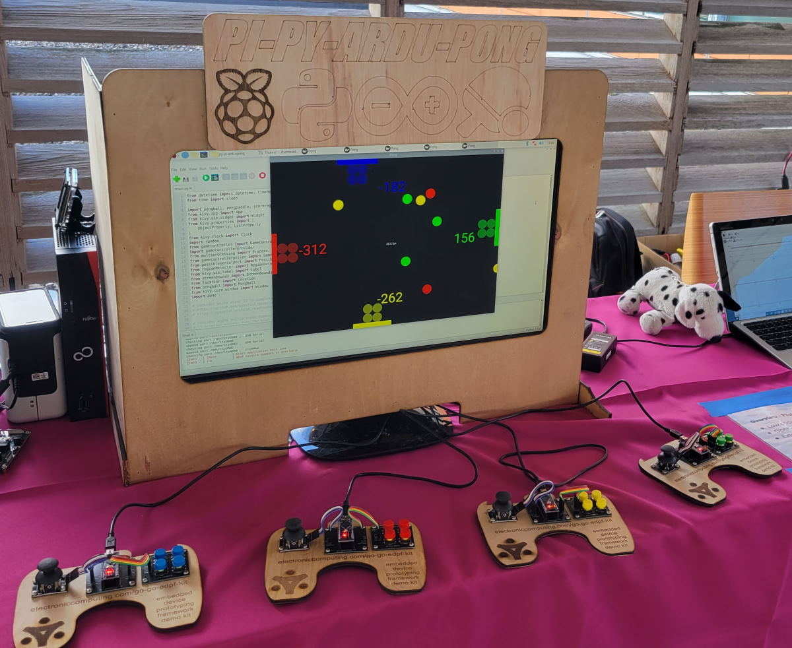
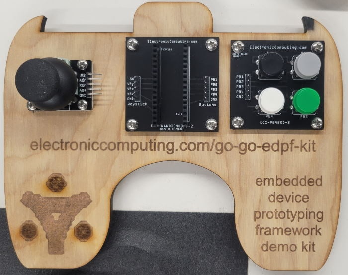
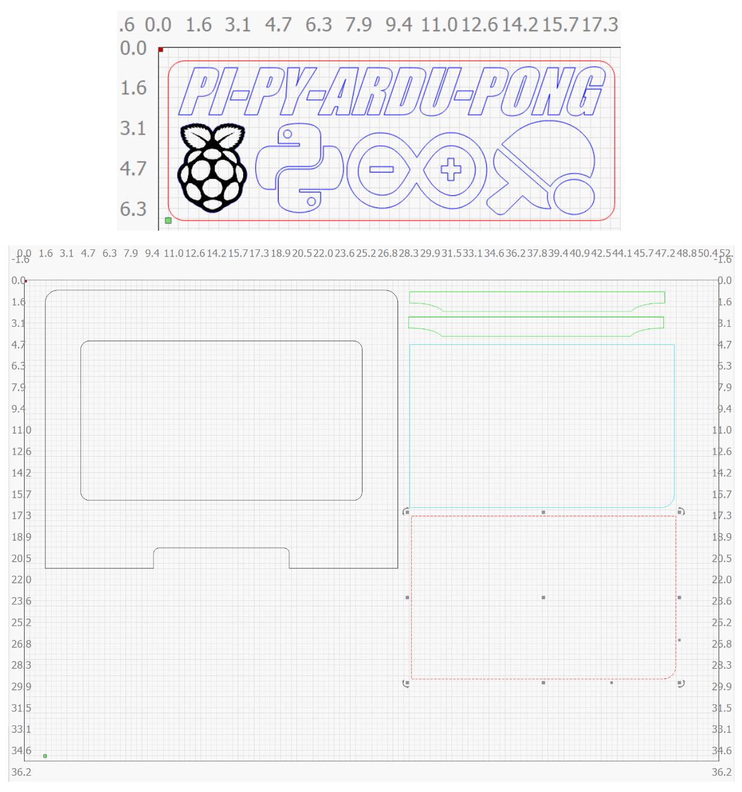

# The Pi-Py-Ardu-Pong Project - Overview
<div style='text-align: center;'>
<br/>
  <i>Pi-Pi-Ardu-Pong Project shown at the Raspberry Pi Jam<br/>(Danforth Plant Science Center, October 2022)</i><br/>
  </div>

[](http://www.youtube.com/watch?v=xUGX6E_JspM "Pi-Py-Ardu-Pong live demo")

Pi-Py-Ardu-Pong is a video game project that combines many technologies of the electronic maker-space community.  It is a 4 player pong like game, that in addition to having more players than the traditional pong, has more bouncing balls and therefore more action.  Players also get to launch the balls, so there is more of an offensive element with this game compared to the traditional Pong.

While the Pi-Py-Ardu-Pong is essentially a game and some would even call it fun, its purpose is to show off the [Embedded Device Prototyping Framework (EDPF) Demo Kit](https://electroniccomputing.com/go-go-edpf-kit/) and the [EDPF firmware](https://github.com/nickhepp/embedded-device-prototyping-framework) which can be used by professionals and hobbyists alike to complete their electronic projects more rapidly than before. 

## Main Components
The project gets its gibberish sounding name from the main components that make up the system:

### Raspberry Pi
The main driver of the system is a Raspberry Pi.  The Pi used for the demo was a Raspberry Pi 4.

### Python
The application running on the Pi was written in Python, and specifically using the Kivy framework to provide the visuals.

### Arduino
The game controllers which are comprised of the [EDPF Demo Kit](https://electroniccomputing.com/go-go-edpf-kit) are driven by Arduinos.  The firmware running on the system uses the "Embedded Device Prototyping Framework", or EDPF for short.  The main project site for the EDPF can be found here: [EDPF Project Site](https://github.com/nickhepp/embedded-device-prototyping-framework).  While the Pi-Py-Ardu-Pong project is a toy, the EDPF project is a framework that supports both professional and hobby projects.  The technology behind the EDPF has been well tested in commercial ventures including defense and health applications.  The firmware code used in the Pi-Py-Ardu-Pong is the [branch that supports the ability to assign a color to the EDPF Demo Kit](https://github.com/nickhepp/embedded-device-prototyping-framework/tree/nick/pi_py_ardu_pong_edition).

<div style='text-align: center;'>
<br/>
  <i>EDPF Kit minus the Arduino and USB cable</i><br/>
</div>

### Pong
The game is an extension of the original arcade classic Pong.

## Pi-Py-Ardu-Pong Box Build Instructions
This project comes with LightBurn files in the `box-build-laser-cutouts` folder of this repo to build your box.
<div style='text-align: center;'>

  <i>Box cutout laser patterns</i>
</div>

## Pi-Py-Ardu-Pong Setup Instructions
Here are the instructions needed to create your own iteration of this project:

1. Prepare you Raspberry Pi - install the official Raspbian distribution on your Raspberry Pi.

2. Install Python and the Kivy framework -  I followed the Kivy instructions and it went relatively well.

3. Create your game controllers - for this you have two options:
    * Purchase an [EDPF Kit from electroniccomputing.com](https://electroniccomputing.com/go-go-edpf-kit) OR
    * Create a game controller from the EDPF Kit project materials
    
4. Download the branch containing the Pi-Py-Ardu-Pong firmware - the Arduino running the EDPF Kit controller needs to be programmed to read the buttons and joystick.  Note, that if you purchased the EDPF Demo Kit that it will already be running the stock EDPF firmware, but the firmware is missing a custom command that allows the controller to identify it as a certain color on the game board.  There is a branch of the EDPF Demo Kit firmware found here: [https://github.com/nickhepp/embedded-device-prototyping-framework/tree/nick/pi_py_ardu_pong_edition](https://github.com/nickhepp/embedded-device-prototyping-framework/tree/nick/pi_py_ardu_pong_edition).  And the command below is to clone the specific branch to your local environment.
```cmd
git clone -b nick/pi_py_ardu_pong_edition https://github.com/nickhepp/embedded-device-prototyping-framework.git edpf_pi_py_ardu_pong
```

5. Program the Arduino uPC - Use your favorite IDE to compile the firmware found at `<edpf_pi_py_ardu_pong repo dir>/Device/BaseKernelDevice` from what you downloaded in the previous step.

6. Create your Raspberry Pi system - install the baseline Raspbian system on your Pi.  I used a basic Pi 4 Model B with 2 GBs RAM for the demo.

7. Install the Kivy framework - I used the [instructions offered straight from the the Kivy documentation](https://kivy.org/doc/stable/installation/installation-rpi.html), and did not have any issues -- hopefully you find the same.

8. Copy the contents of [this Pi-Py-Ardu-Pong repo](https://github.com/nickhepp/pi-py-ardu-pong) somewhere to the Pi and execute.  I simply chose the desktop, and for my version of Raspbian it opened opened a text editor with Python execution abilities by default.

That should be all the steps you need to configure the electronic portion of the project.


## Future Enhancements

Overall the game had a great response from those that played it.  Kids were coming back to the booth to play and asking their parents to join in.  There were some enhancement ideas I had after seeing the kids play:
* Easy score reset - the game would be running for hours and so the score became lopsided.  It would be nice for some sort of push button ability that would allow for a score reset.  Maybe a new button could be pressed, that or some hard to pull off combination of button presses on a remote could reset the score.
* Longer USB cables - I used 3 foot cables, but I should have used 6 foot cables to give people plenty of space
* Make the window have a square aspect ratio - Currently the window size can be any size within the screen, and this means players on the longer dimensions are at a disadvantage with having to protect a larger area.  It would probably be best if the screen itself were a square b/c you could see Linux background beyond the window.

## TODOs
* Backup the disk image (https://www.tomshardware.com/how-to/back-up-raspberry-pi-as-disk-image)
